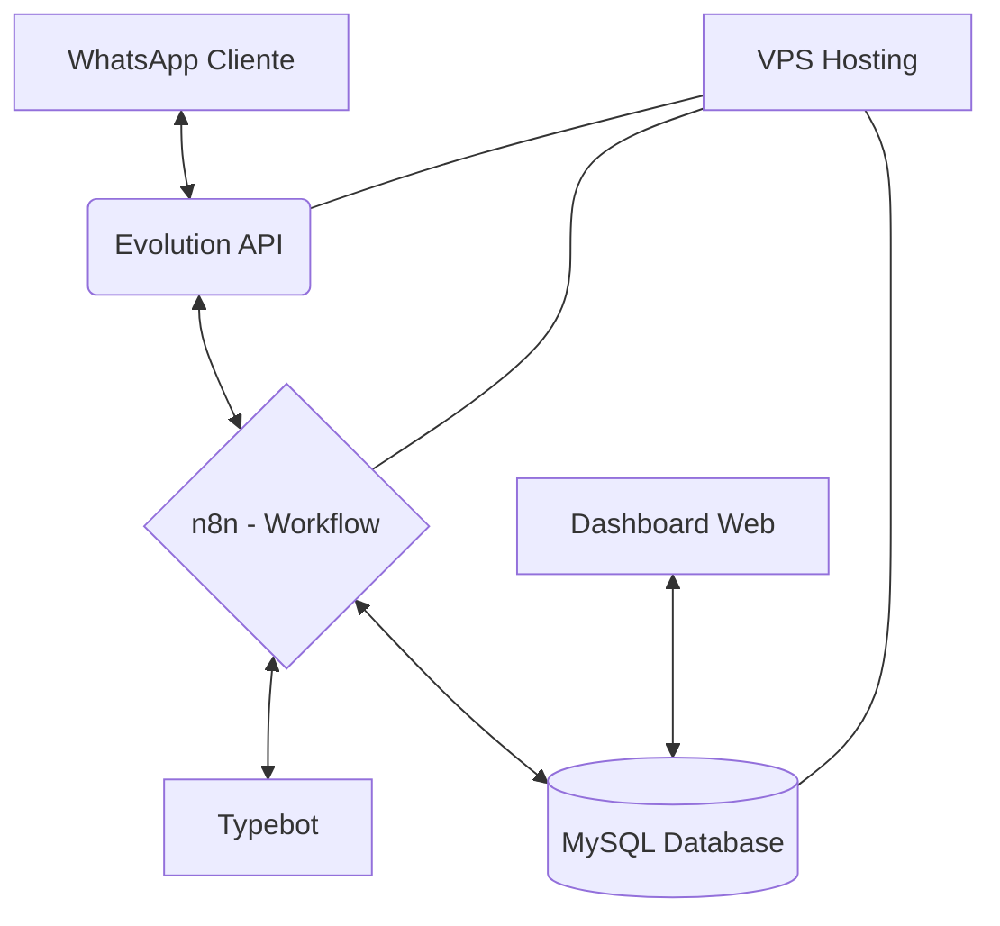

# 💈 BarberManager — Automação de Agendamentos & Dashboard Administrativo

Este projeto é uma **solução completa de automação e gestão** desenvolvida para a **Logikabots**. O ecossistema integra um **chatbot inteligente via WhatsApp** a um **painel web administrativo**, permitindo que barbearias operem de forma 100% autônoma no atendimento inicial e agendamento.

> [!IMPORTANTE]
> **Status do Desenvolvimento:** Atualmente, a gestão de serviços e barbeiros é realizada via **Dashboard Web**. O **aplicativo mobile nativo** já está em fase de desenvolvimento para oferecer ainda mais mobilidade e notificações em tempo real aos proprietários.

---

## 🛠️ Stack Tecnológica

A arquitetura foi desenhada para ser **escalável e robusta**, utilizando as melhores tecnologias do mercado:

* **Interface Web (Dashboard):** Construída com **HTML5, CSS3, JavaScript (ES6+)** e **Tailwind CSS** para garantir uma interface **Mobile First** e ultra-responsiva.
* **Engine Conversacional:** [Typebot](https://typebot.io/) para a criação de fluxos de atendimento **humanizados e dinâmicos**.
* **Orquestração & Backend:** [n8n](https://n8n.io/) como o "cérebro" da operação, processando lógicas complexas e integrações de APIs.
* **Mensageria Profissional:** [Evolution API](https://evolution-api.com/) para uma conexão estável e segura com a **API do WhatsApp**.
* **Banco de Dados:** **MySQL** para armazenamento persistente de dados, garantindo **integridade e segurança** das informações.
* **Infraestrutura:** Servidor **VPS dedicado**, configurado para manter todo o ecossistema com **disponibilidade 24/7**.

---

## 🚀 O que a Solução Resolve?

### 🤖 Automação de Agendamentos (O Bot)
O chatbot atua como uma **secretária virtual 24h**. O cliente pode consultar serviços, escolher o barbeiro e verificar horários disponíveis sem qualquer intervenção humana. Todo o processo é validado em **tempo real** contra o banco de dados.

### 📊 Gestão do Proprietário (O Dashboard)
O painel administrativo oferece **controle total** sobre a operação com foco em gestão baseada em dados:
* **Visualização em Tempo Real:** Tela dedicada para acompanhar agendamentos filtrados por **Hoje, Amanhã e Semana**.
* **Previsão de Faturamento:** Cálculo automático de **estimativa de caixa diário**, permitindo que o dono saiba exatamente o valor projetado (ex: R$ 1.000,00 previstos para o dia atual).
* **Configuração Dinâmica:** Edição imediata de horários, serviços e valores que refletem no bot instantaneamente.
* **Gestão de Equipe:** Cadastro e gerenciamento de barbeiros e suas agendas individuais.

---

## 📐 Arquitetura de Comunicação

O diagrama abaixo detalha o fluxo de dados entre as ferramentas hospedadas na VPS:


## 📊 Fluxos de Automação (Visualização n8n)

| PROCESSO | DESCRIÇÃO TÉCNICA | PREVIEW |
| :--- | :---: | ---: |
| **Entrada de mensagem** | Triagem inteligente e direcionamento de fluxos via Webhooks. |  |
| **Cadastro de Leads** | Verificação de existência e registro automático no **MySQL**. |  |
| **Gestão de Agenda** | Lógica de consulta (SELECT) e cancelamento (UPDATE) de horários. |  |
| **Agendamento** | Processamento de transações e escrita no banco de dados. |  |

## 🗂️ Estrutura do Repositório
```text
├── /dashboard-web/            # Painel administrativo da barbearia
│   ├── index.html
│   ├── css/
│   └── js/
├── /sql-schema/               # Estrutura das tabelas MySQL
│   ├── database.sql
│   └── sample-data.sql
├── /img/                      # Galeria de capturas de tela e fluxos
│   ├── fluxo-agendamento.png
│   ├── fluxo-confirmacao.png
│   ├── fluxo-clientes.png
│   └── fluxo-relatorios.png
├── /n8n-flows/                # Export dos fluxos do n8n (JSON)
└── README.md
```

## 💡 Diferenciais Técnicos deste Projeto
- **Sincronização em Tempo Real:** Alterações no Dashboard impactam o fluxo do Bot sem necessidade de reiniciar serviços.

- **Segurança:** Implementação de variáveis de ambiente para proteção de credenciais da API e Banco de Dados.

- **Robustez:** Tratamento de erros no n8n para evitar travamentos em respostas inesperadas do usuário.

## 🎯 Status do Projeto
✅ Dashboard Web - Concluído

✅ Fluxos n8n - Concluídos

✅ Banco de Dados - Concluído

⚠️ App Mobile - Em desenvolvimento

🔧 Integrações - Em operação contínua

Última atualização: Fevereiro 2026

## 👤 Contato

**Desenvolvido por:** Gabriel Franco. 🚀

- **LinkedIn:** https://www.linkedin.com/in/gabriel-franc0/.

- **E-mail:** gafranco.contato@gmail.com
